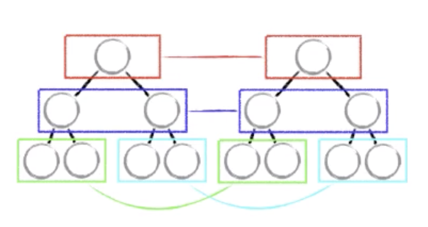

# mixin、hoc、hook

图

# 渲染过程

- react.createElement 
- reactElement对象（vdom）
- reactDOM.render ==> 真实dom

# vdom

- 组成
1、type（元素类型：html，自定义组件） 
2、key （用于diff算法）
3、refs 
4、props 
5、owner 
6、self 
7、_source

- 解决的三个重要问题

1、高效的diff算法
2、只更新需要更新的dom节点
3、数据变化的检测，batch dom读写操作

- diff算法

递归循环，复杂度特别高
递归：O(n^3) 
react vdom diff O(n)

为什么是 O(n^3)？ 因为以下diff策略

1、是同层比较，不跨层比较
2、相同的component有相同的tree结构
3、同一层级的子节点，key

tree diff、component diff、element diff

- tree diff

同层对比

updateDepth

Q: 如果有跨层级的移动，应该如何处理?

createA -> createB -> createC -> deleteA

- component diff

1、 same component
2、 diff component, dirty component,替换所有子节点
3、 shouldComponentUpdate()（常用于性能优化）

- element diff

insert_markup
move_existing
delete_node

move_existing：

generateComponentChildren 调用 receiveCompontent， prev = next

key这个东西，给tree中的每一个元素都标记一个key，

lastIndex，顺序优化

- 总结 diff 算法

o(n^3) => o(n)
分层比较
component diff
key - element diff
建议：开发组件，dom结构稳定，提升性能
建议：避免直接将航尾的元素直接插到最前面
建议：善用shouldComponentUpdate()-告诉react 需不需要去做diff

- snabbdom 库

双端比较算法

inferno.js 号称最快的diff算法

# 调度

线程和渲染是互斥的

# fiber

- vdom 层
- reconciler层：在这一层做一些事情，架构设计：
   
   计算任务的 time (expriationTime：当前时间 + 常量)
   requestIdleCallback polyfill 版本 （作业)

- render层： reactDOM，RN

# time slice

requestAnimationFrame: 在浏览器空闲的时候调用此API

requestIdleCallback: 千万不要做dom的操作，因为异步代表时间不可控

requestAnimationFrame + 上一帧到下一帧的时间 + messagechannel

# eventemmier.js【待定】

<!-- 动作出不来该怎么办 -->